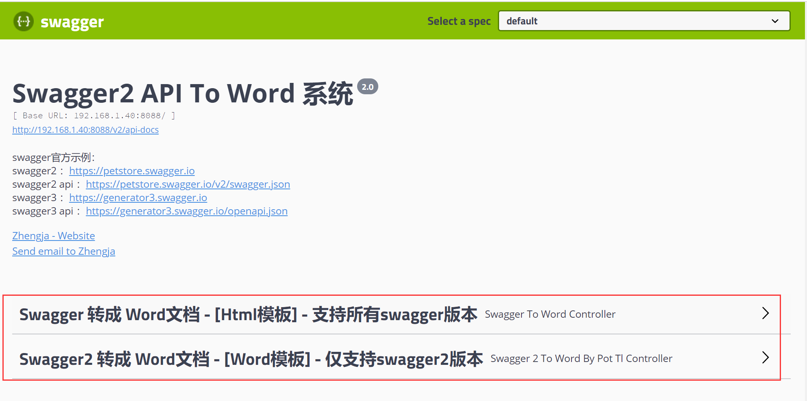
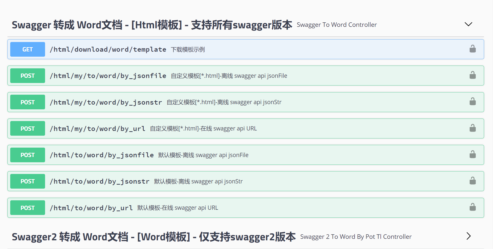
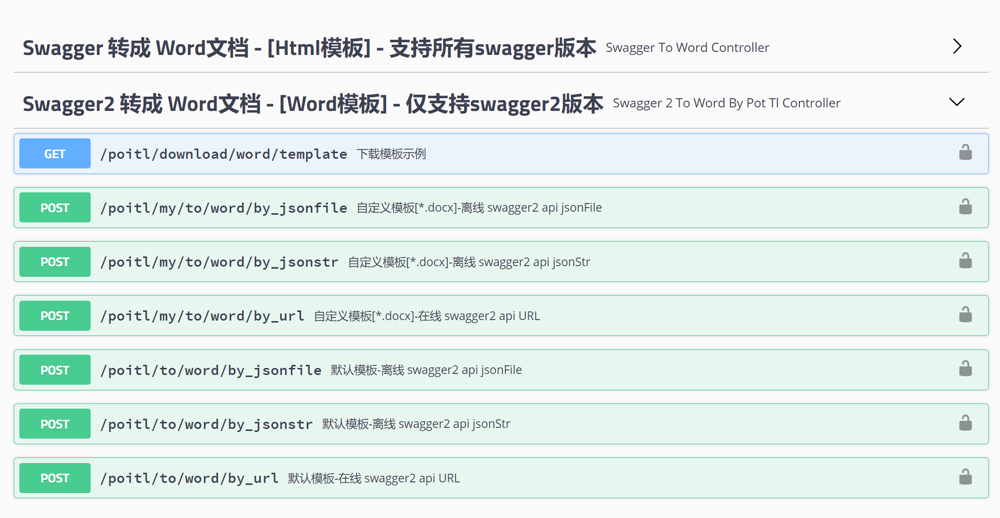
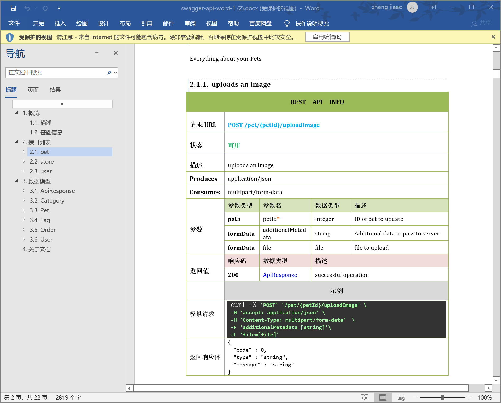
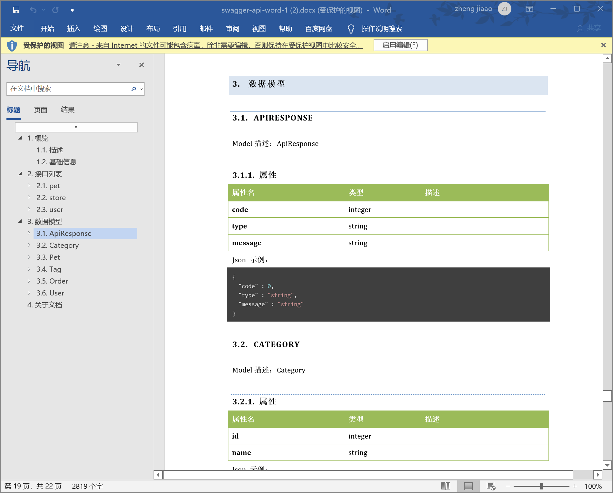

# swagger to word

## 介绍

swagger to word 是一个基于java的swagger文档生成word文档工具，主要用于生成swagger文档的word文档。

主要功能有：

- 支持swagger 转 word 文档
- 支持swagger 转 html 文档

说明：swaggger 转 word 文档的模板(模板实现可自定义模板)

## 参考来源

- [swagger2word](https://github.com/JMCuixy/swagger2word)
- [Sayi-poi-tl](https://github.com/Sayi/poi-tl)

## 示例

### 接口示例图：

### 生成word文档的效果图

模板1-效果图：

其它模板自己尝试一下把，效果图就不贴出来了，最大特点是支持自定义模板哦。

